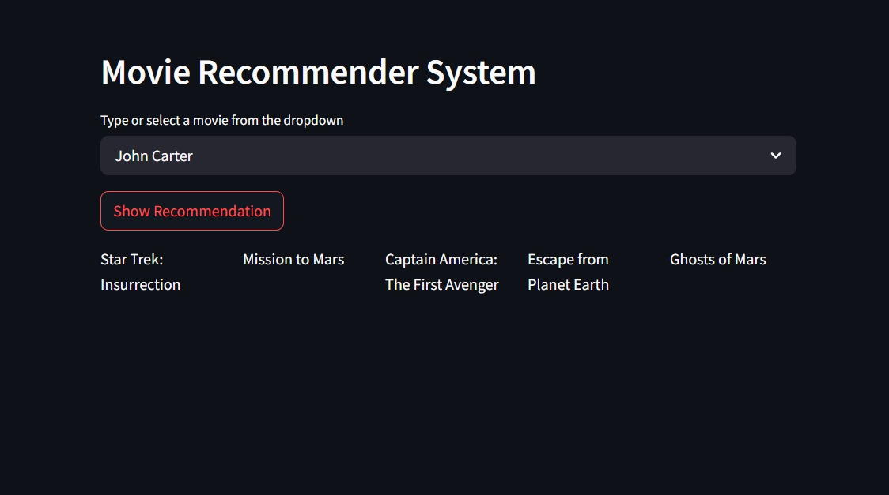

# 🎬 Movie Recommender System

This is a **content-based Movie Recommender System** built using **Streamlit**. Given a movie title, it suggests 5 similar movies based on feature similarity using a precomputed similarity matrix.

---

## 🚀 Features

- Recommends 5 movies similar to the selected one
- Clean and interactive UI using Streamlit
- Fast results using a precomputed cosine similarity matrix
- Modular and easy to extend with posters or other metadata

---

## 🖼️ Demo

> 📌 Replace `assets/demo.png` with your own UI screenshot in that location.

---

## 🛠️ How It Works

- **`movie_dict.pkl`**: Dictionary with movie metadata (titles, IDs, etc.)
- **`similarity.pkl`**: Cosine similarity matrix between movies
- Select a movie → fetch top 5 most similar based on similarity scores

---

